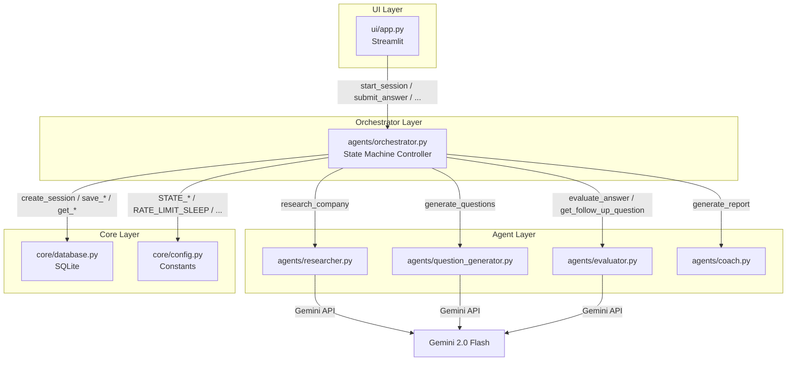
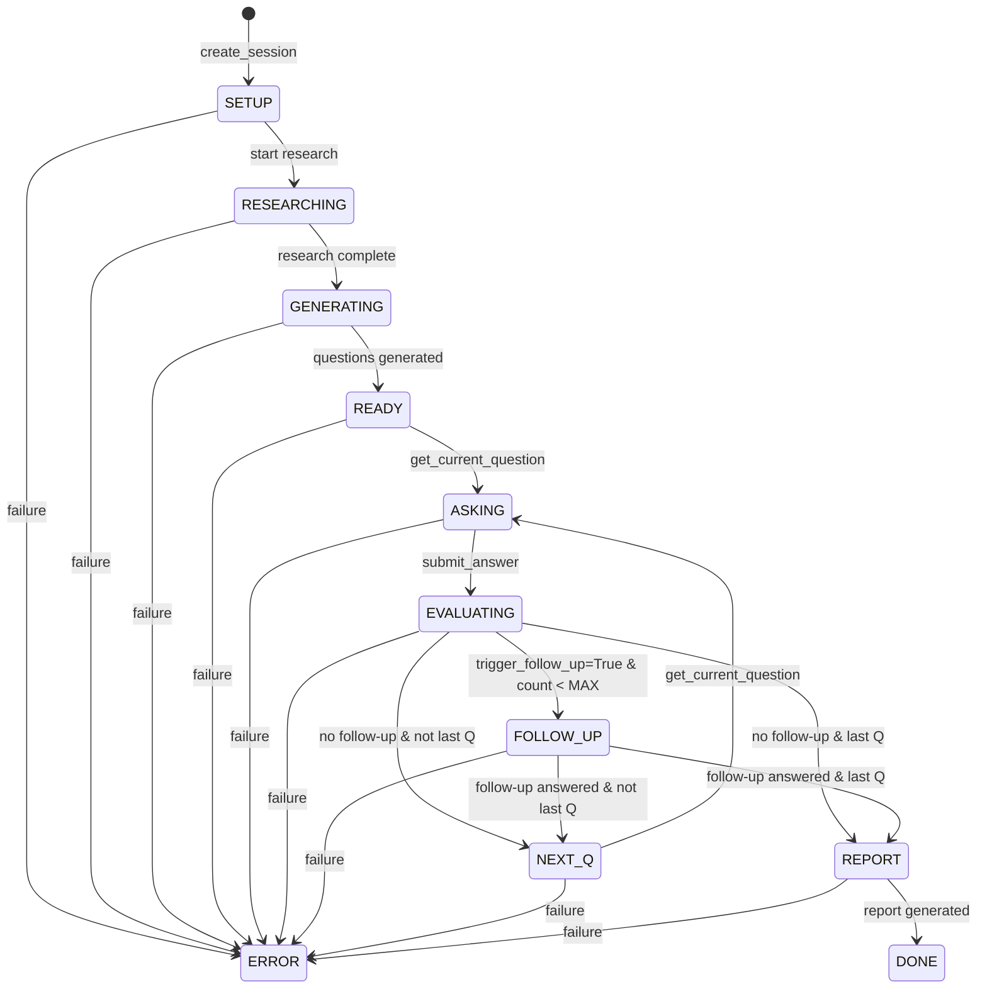

# Design Document: Orchestrator Agent

## Overview

The Orchestrator Agent (`agents/orchestrator.py`) is the central state machine controller for the Mock Interview Stress Tester. It sequences calls to four existing agents (Researcher, QuestionGenerator, Evaluator, Coach), enforces state transitions, validates all agent output contracts, and persists state to SQLite via `core/database.py`.

**Design Principles:**
- Pure functions with no module-level mutable state — all state derived from the database per call
- Fail-safe: any agent failure transitions to STATE_ERROR with a stored reason
- Contract-first: all agent outputs validated before persistence
- Rate-limited: mandatory sleep between consecutive LLM calls
- Session-scoped: every function takes `session_id` and operates only on that session's data

**Public API Surface (5 functions):**
1. `start_session(company, role, level)` → `str` (session_id)
2. `get_current_question(session_id)` → `dict` (Question_Dict)
3. `submit_answer(session_id, answer_text)` → `dict` (Evaluation_Dict + optional follow-up)
4. `get_current_state(session_id)` → `str` (state label)
5. `generate_final_report(session_id)` → `dict` (Report_Dict)

## Architecture

### High-Level System Diagram



### State Machine Diagram



### Permitted State Transitions Table

| From State    | To State      | Trigger                                      |
|---------------|---------------|----------------------------------------------|
| SETUP         | RESEARCHING   | Research call initiated                      |
| RESEARCHING   | GENERATING    | Research complete + validated                |
| GENERATING    | READY         | Questions generated + validated              |
| READY         | ASKING        | `get_current_question` called                |
| ASKING        | EVALUATING    | `submit_answer` called                       |
| EVALUATING    | FOLLOW_UP     | trigger_follow_up=True & count < MAX_FOLLOW_UPS |
| EVALUATING    | NEXT_Q        | No follow-up, not last question              |
| EVALUATING    | REPORT        | No follow-up, last question answered         |
| FOLLOW_UP     | NEXT_Q        | Follow-up answer submitted, not last Q       |
| FOLLOW_UP     | REPORT        | Follow-up answer submitted, last Q           |
| NEXT_Q        | ASKING        | `get_current_question` cycles back           |
| REPORT        | DONE          | Report generated + validated                 |
| Any           | ERROR         | Agent failure / validation failure           |

## Components and Interfaces

### Module Structure

```python
# agents/orchestrator.py

# Module-level constants (immutable, permitted)
MAX_INPUT_LENGTH: int = 200
MAX_ERROR_REASON_LENGTH: int = 500
MAX_RETRIES: int = 2

# Private helpers
def _validate_session_exists(session_id: str) -> dict
def _validate_not_terminal(session: dict) -> None
def _transition(session_id: str, current_state: str, new_state: str) -> None
def _validate_research_dict(data: dict) -> None
def _validate_questions_list(data: list) -> None
def _validate_evaluation_dict(data: dict) -> None
def _validate_report_dict(data: dict) -> None
def _handle_error(session_id: str, reason: str) -> None

# Public API
def start_session(company: str, role: str, level: str) -> str
def get_current_question(session_id: str) -> dict
def submit_answer(session_id: str, answer_text: str) -> dict
def generate_final_report(session_id: str) -> dict
def get_current_state(session_id: str) -> str
```

### Component Interactions

**start_session flow:**
1. Validate inputs (company, role, level, API key)
2. Generate UUID → `create_session` → STATE_SETUP
3. Transition to RESEARCHING → call `research_company` → validate → `save_research`
4. Sleep RATE_LIMIT_SLEEP
5. Transition to GENERATING → call `generate_questions` → validate → `save_questions`
6. Transition to READY
7. Return session_id

**get_current_question flow:**
1. Validate session exists and is not terminal
2. Determine q_index from answer count
3. If state is READY or NEXT_Q → transition to ASKING
4. If already ASKING → idempotent (no transition)
5. Retrieve Question_Dict from DB → return

**submit_answer flow:**
1. Validate session exists, not terminal, state is ASKING or FOLLOW_UP
2. Validate answer_text non-empty
3. Determine q_index, check no duplicate
4. Transition to EVALUATING → call `evaluate_answer` → validate
5. Save answer + evaluation
6. Determine next state based on trigger_follow_up, follow_up count, and question position
7. Return evaluation dict (+ optional follow_up_question)

**generate_final_report flow:**
1. Validate session exists, not terminal
2. If STATE_DONE and report exists → return cached report (idempotent)
3. Verify all TOTAL_QUESTIONS answered
4. Transition to REPORT → call `generate_report` → validate → strip extra keys → `save_report`
5. Transition to DONE → return Report_Dict

### Dependency Map

```
agents/orchestrator.py
├── imports from core/config.py:
│   STATE_SETUP, STATE_RESEARCHING, STATE_GENERATING, STATE_READY,
│   STATE_ASKING, STATE_EVALUATING, STATE_FOLLOW_UP, STATE_NEXT_Q,
│   STATE_REPORT, STATE_DONE, STATE_ERROR,
│   TOTAL_QUESTIONS, MAX_FOLLOW_UPS, RATE_LIMIT_SLEEP,
│   ERROR_RETRY_SLEEP, GEMINI_API_KEY
├── imports from core/database.py:
│   create_session, get_session, save_research, save_questions,
│   save_answer, get_answers, save_report
├── imports from agents/researcher.py:
│   research_company
├── imports from agents/question_generator.py:
│   generate_questions, QuestionGenerationError
├── imports from agents/evaluator.py:
│   evaluate_answer, get_follow_up_question
├── imports from agents/coach.py:
│   generate_report
└── stdlib imports:
    uuid, time, json
```

## Data Models

### Session State (database row)

```python
# Returned by get_session(session_id)
SessionDict = {
    "session_id": str,   # UUID
    "company": str,
    "role": str,
    "level": str,
    "state": str,        # One of STATE_* constants
    "created_at": str,   # ISO-8601
}
```

### Research_Dict (8 required keys)

```python
ResearchDict = {
    "company": str,
    "role": str,
    "interview_rounds": list[str],
    "key_topics": list[str],
    "difficulty": str,
    "culture_keywords": list[str],
    "known_question_types": list[str],
    "red_flags_to_test": list[str],
    # Optional: "error_flag": bool (True = fallback data)
}
```

### Question_Dict (7 required keys per item, 10 items)

```python
QuestionDict = {
    "id": str,                    # UUID
    "category": str,              # e.g. "system_design", "behavioral"
    "question": str,              # The interview question text
    "ideal_keywords": list[str],  # Expected keywords in a good answer
    "difficulty": int,            # 1-5
    "follow_ups": list[str],     # Exactly 2 follow-up questions
    "scoring_hint": str,          # Hint for evaluator
}
```

### Evaluation_Dict (6 required keys)

```python
EvaluationDict = {
    "scores": {
        "relevance": int,   # 1-5
        "depth": int,       # 1-5
        "structure": int,   # 1-5
        "examples": int,    # 1-5
    },
    "total": int,           # 4-20 (sum of subscores)
    "verdict": str,         # "weak" | "good" | "strong"
    "feedback": str,        # Detailed feedback text
    "missing_keywords": list[str],
    "trigger_follow_up": bool,
}
```

### Report_Dict (11 required keys)

```python
ReportDict = {
    "overall_score": int,
    "hiring_probability": str,            # "Low" | "Medium" | "High"
    "hiring_probability_percent": int,    # 0-100
    "strongest_category": str,
    "weakest_category": str,
    "category_averages": dict[str, float],
    "top_3_strengths": list[str],         # Exactly 3
    "top_3_improvements": list[str],      # Exactly 3
    "critical_moment": str,
    "overall_verdict": str,
    "next_interview_tip": str,
}
```

### Transition Validation Map (internal)

```python
# Allowed transitions: dict mapping current_state → set of valid next_states
_VALID_TRANSITIONS: dict[str, set[str]] = {
    STATE_SETUP:      {STATE_RESEARCHING, STATE_ERROR},
    STATE_RESEARCHING:{STATE_GENERATING, STATE_ERROR},
    STATE_GENERATING: {STATE_READY, STATE_ERROR},
    STATE_READY:      {STATE_ASKING, STATE_ERROR},
    STATE_ASKING:     {STATE_EVALUATING, STATE_ERROR},
    STATE_EVALUATING: {STATE_FOLLOW_UP, STATE_NEXT_Q, STATE_REPORT, STATE_ERROR},
    STATE_FOLLOW_UP:  {STATE_NEXT_Q, STATE_REPORT, STATE_ERROR},
    STATE_NEXT_Q:     {STATE_ASKING, STATE_ERROR},
    STATE_REPORT:     {STATE_DONE, STATE_ERROR},
    STATE_DONE:       set(),  # Terminal
    STATE_ERROR:      set(),  # Terminal
}
```

### Submit Answer Return Dict

```python
SubmitAnswerResult = {
    # All EvaluationDict keys included:
    "scores": dict,
    "total": int,
    "verdict": str,
    "feedback": str,
    "missing_keywords": list,
    "trigger_follow_up": bool,
    # Optional key — present only when follow-up triggered and available:
    "follow_up_question": str,  # or absent
}
```


## Correctness Properties

*A property is a characteristic or behavior that should hold true across all valid executions of a system — essentially, a formal statement about what the system should do. Properties serve as the bridge between human-readable specifications and machine-verifiable correctness guarantees.*

### Property 1: Input validation rejects invalid strings without side effects

*For any* string that is empty, contains only whitespace, or exceeds MAX_INPUT_LENGTH characters after stripping, when passed as company, role, or level to `start_session`, the function SHALL raise a ValueError identifying the invalid parameter, and no session SHALL be created in the database.

**Validates: Requirements 1.4, 1.5, 1.6, 9.1, 9.2, 9.5**

### Property 2: Non-existent session_id raises ValueError across all public functions

*For any* UUID string that does not correspond to a row in the sessions table, calling any of the four session-scoped public functions (`get_current_question`, `submit_answer`, `generate_final_report`, `get_current_state`) SHALL raise a ValueError indicating session not found, with no database modifications.

**Validates: Requirements 2.5, 3.7, 4.5, 5.2, 9.4, 11.3**

### Property 3: State transition validity is determined exclusively by the transitions map

*For any* session in state S and any proposed target state T, the `_transition` function SHALL succeed if and only if T is in the set of valid transitions for S. Invalid transitions SHALL raise ValueError containing both S and T in the message, and the database state SHALL remain unchanged. Terminal states (DONE, ERROR) SHALL reject all transitions.

**Validates: Requirements 6.1, 6.3, 6.4, 6.5**

### Property 4: Agent output contract validation catches all missing keys

*For any* dict returned by an agent that is missing one or more required keys (8 for Researcher, 7×10 for QuestionGenerator, 6 for Evaluator, 11 for Coach), the orchestrator's validation function SHALL reject it, transition the session to STATE_ERROR, and include the agent name and missing key information in the error reason. Validation SHALL complete before any database persistence.

**Validates: Requirements 7.1, 7.2, 7.3, 7.4, 7.5, 7.6, 8.2**

### Property 5: Evaluation outcome determines correct next state

*For any* evaluation result with a given `trigger_follow_up` value, follow-up count, and question index, the orchestrator SHALL transition to: STATE_FOLLOW_UP if trigger=True AND count < MAX_FOLLOW_UPS AND get_follow_up_question returns non-None; STATE_NEXT_Q if trigger=False AND q_index < TOTAL_QUESTIONS-1; STATE_REPORT if trigger=False AND q_index == TOTAL_QUESTIONS-1; STATE_NEXT_Q if trigger=True but count >= MAX_FOLLOW_UPS or follow-up is None (and not last question).

**Validates: Requirements 3.2, 3.3, 3.4, 3.6, 15.2**

### Property 6: Duplicate and out-of-order submissions are rejected

*For any* session with N answers already persisted (0 ≤ N < TOTAL_QUESTIONS), calling `submit_answer` for any q_index ≠ N SHALL raise a ValueError. The error message SHALL contain both the submitted index and the expected index. No database write SHALL occur.

**Validates: Requirements 3.9, 14.1, 14.2, 14.4**

### Property 7: Agent exceptions transition to STATE_ERROR with truncated reason

*For any* agent that raises an exception with message M during execution, the orchestrator SHALL catch it, transition the session to STATE_ERROR, and store a reason string of at most MAX_ERROR_REASON_LENGTH (500) characters. The reason SHALL be retrievable from the database afterward.

**Validates: Requirements 8.1, 8.3**

### Property 8: get_current_state is a pure read operation

*For any* session in any state, calling `get_current_state` SHALL return the current state label as a string matching one of the 11 valid STATE_* constants, and SHALL NOT modify the session's state in the database (state before call == state after call).

**Validates: Requirements 5.1, 5.3**

### Property 9: get_current_question is idempotent in STATE_ASKING

*For any* session in STATE_ASKING with N answers (0 ≤ N < TOTAL_QUESTIONS), calling `get_current_question` multiple times SHALL return the same Question_Dict with exactly 7 keys each time, and the session state SHALL remain STATE_ASKING after each call.

**Validates: Requirements 2.4, 2.8**

### Property 10: Follow-up counter resets on question advance

*For any* session that has exhausted follow-ups (counter == MAX_FOLLOW_UPS) on question N and then advances to question N+1 via NEXT_Q → ASKING, the follow-up counter for question N+1 SHALL be 0, allowing up to MAX_FOLLOW_UPS new follow-ups.

**Validates: Requirements 15.1, 15.3, 15.4**

### Property 11: Report generation is idempotent once STATE_DONE

*For any* session in STATE_DONE with a saved report, calling `generate_final_report` SHALL return the previously saved Report_Dict without invoking Coach_Agent again, and the session state SHALL remain STATE_DONE.

**Validates: Requirements 4.3**

### Property 12: Extra report keys are stripped

*For any* Report_Dict returned by Coach_Agent containing the 11 required keys plus any number of extra keys, the orchestrator SHALL return and persist a dict containing exactly the 11 required keys with no extras.

**Validates: Requirements 4.7**

### Property 13: Rate limiting between LLM calls

*For any* session flow that involves multiple consecutive LLM-adjacent agent calls (e.g., start_session calls Researcher then QuestionGenerator), the orchestrator SHALL invoke `time.sleep(RATE_LIMIT_SLEEP)` between the completion of one call and the start of the next.

**Validates: Requirements 10.1, 10.4**

### Property 14: Whitespace-only answer text is rejected

*For any* string composed entirely of whitespace characters (spaces, tabs, newlines), calling `submit_answer` with that string SHALL raise a ValueError, and no answer SHALL be persisted.

**Validates: Requirements 9.3**

### Property 15: Session isolation under concurrent access

*For any* two distinct session_ids executing operations concurrently, all database reads and writes performed by the orchestrator SHALL be scoped exclusively to the provided session_id. No function call SHALL return, modify, or overwrite data belonging to a different session.

**Validates: Requirements 11.5**

### Property 16: Incomplete sessions reject report generation

*For any* session with fewer than TOTAL_QUESTIONS answers persisted, calling `generate_final_report` SHALL raise a ValueError indicating how many answers are missing.

**Validates: Requirements 4.2**

## Error Handling

### Error Categories and Responses

| Error Type | Source | Response |
|---|---|---|
| Invalid input (empty/whitespace/too long) | Caller | ValueError raised immediately, no state change |
| Non-existent session_id | Caller | ValueError "session not found" |
| Terminal state operation | Caller | ValueError "session in terminal state" |
| Agent exception | Researcher/QG/Evaluator/Coach | Catch → STATE_ERROR with reason ≤500 chars |
| Agent contract violation | Any agent output | STATE_ERROR with agent name + missing keys |
| 429 Rate limit | Gemini API (via agent) | Retry up to MAX_RETRIES times with ERROR_RETRY_SLEEP |
| Duplicate submission | Caller | ValueError with duplicate q_index |
| DB persistence failure during error handling | SQLite | Log to stdout, treat session as errored |

### Error Handling Pseudocode

```python
def _handle_error(session_id: str, reason: str) -> None:
    """Transition session to STATE_ERROR and persist reason."""
    truncated = reason[:MAX_ERROR_REASON_LENGTH]
    try:
        # Update session state to ERROR in DB
        _update_session_state(session_id, STATE_ERROR)
        # Store error reason (requires DB schema support or state field)
    except Exception as db_err:
        print(f"[Orchestrator] Failed to persist error: {db_err}")
    # Session is treated as errored regardless of DB success
```

### Retry Logic for 429 Errors

```python
def _call_with_retry(agent_fn, args, session_id: str) -> Any:
    """Call an agent function with retry logic for rate-limit errors."""
    for attempt in range(MAX_RETRIES + 1):  # 0, 1, 2 = initial + 2 retries
        try:
            return agent_fn(*args)
        except Exception as e:
            if "429" in str(e) and attempt < MAX_RETRIES:
                print(f"[Orchestrator] 429 error, retry {attempt+1}/{MAX_RETRIES}")
                time.sleep(ERROR_RETRY_SLEEP)
            else:
                raise
```

## Testing Strategy

### Dual Testing Approach

This feature uses both **unit tests** (example-based) and **property-based tests** (via Hypothesis) for comprehensive coverage.

### Property-Based Testing (Hypothesis)

The orchestrator is highly suitable for property-based testing because:
- Pure function API with clear input/output contracts
- State machine transitions follow universal rules across all inputs
- Contract validation logic operates on arbitrary dict structures
- Input validation rules apply universally across string inputs

**Library:** [Hypothesis](https://hypothesis.readthedocs.io/) (Python PBT library)
**Minimum iterations:** 100 per property
**Tag format:** `# Feature: orchestrator-agent, Property N: <title>`

**Properties to implement as PBT:**
1. Input validation (Property 1) — generate random invalid strings
2. Non-existent session raises ValueError (Property 2) — generate random UUIDs
3. State transition map enforcement (Property 3) — generate all state pairs
4. Agent contract validation (Property 4) — generate random dicts with subsets of keys
5. Evaluation branching logic (Property 5) — generate (trigger, count, q_index) tuples
6. Duplicate/out-of-order rejection (Property 6) — generate (answer_count, submitted_index) pairs
7. Exception handling with truncation (Property 7) — generate random exception messages
8. get_current_state purity (Property 8) — generate sessions in all states
9. get_current_question idempotency (Property 9) — generate answer counts
10. Follow-up counter reset (Property 10) — generate multi-question sequences
11. Report idempotency (Property 11) — call generate_final_report twice
12. Extra key stripping (Property 12) — generate dicts with extra random keys
13. Rate limiting (Property 13) — mock time.sleep, verify call timing
14. Whitespace rejection (Property 14) — generate whitespace-only strings
15. Session isolation (Property 15) — generate pairs of session operations
16. Incomplete report rejection (Property 16) — generate answer counts 0-9

### Unit Tests (Example-Based)

For specific scenarios not well-suited to property testing:
- `start_session` happy path with mocked agents (end-to-end flow)
- Researcher error_flag=True proceeds normally
- QuestionGenerationError transitions to STATE_ERROR
- Empty GEMINI_API_KEY raises ValueError
- get_current_question from STATE_READY transitions to ASKING
- get_current_question from STATE_NEXT_Q transitions to ASKING
- Follow_Up_Function returning None falls through
- trigger_follow_up=True on last question still enters FOLLOW_UP
- Coach_Agent failure transitions to STATE_ERROR
- Terminal state (DONE/ERROR) rejects all operations except get_current_state

### Test Organization

```
tests/
├── test_orchestrator.py          # Unit tests (example-based)
└── test_orchestrator_props.py    # Property-based tests (Hypothesis)
```

### Mocking Strategy

All agent calls and database operations are mocked in tests:
- `unittest.mock.patch` for agent functions (researcher, question_generator, evaluator, coach)
- In-memory dict or mock for database functions where needed
- `time.sleep` mocked to avoid actual delays in tests

## Low-Level Design

### Function Signatures and Algorithms

#### Module Constants

```python
# agents/orchestrator.py — top of file

import json
import time
import uuid

from core.config import (
    STATE_SETUP, STATE_RESEARCHING, STATE_GENERATING, STATE_READY,
    STATE_ASKING, STATE_EVALUATING, STATE_FOLLOW_UP, STATE_NEXT_Q,
    STATE_REPORT, STATE_DONE, STATE_ERROR,
    TOTAL_QUESTIONS, MAX_FOLLOW_UPS, RATE_LIMIT_SLEEP,
    ERROR_RETRY_SLEEP, GEMINI_API_KEY,
)
from core.database import (
    create_session, get_session, save_research, save_questions,
    save_answer, get_answers, save_report,
)
from agents.researcher import research_company
from agents.question_generator import generate_questions, QuestionGenerationError
from agents.evaluator import evaluate_answer, get_follow_up_question
from agents.coach import generate_report

# Module-level immutable constants
MAX_INPUT_LENGTH: int = 200
MAX_ERROR_REASON_LENGTH: int = 500
MAX_RETRIES: int = 2
```

#### Transition Map

```python
_VALID_TRANSITIONS: dict[str, set[str]] = {
    STATE_SETUP:       {STATE_RESEARCHING, STATE_ERROR},
    STATE_RESEARCHING: {STATE_GENERATING, STATE_ERROR},
    STATE_GENERATING:  {STATE_READY, STATE_ERROR},
    STATE_READY:       {STATE_ASKING, STATE_ERROR},
    STATE_ASKING:      {STATE_EVALUATING, STATE_ERROR},
    STATE_EVALUATING:  {STATE_FOLLOW_UP, STATE_NEXT_Q, STATE_REPORT, STATE_ERROR},
    STATE_FOLLOW_UP:   {STATE_NEXT_Q, STATE_REPORT, STATE_ERROR},
    STATE_NEXT_Q:      {STATE_ASKING, STATE_ERROR},
    STATE_REPORT:      {STATE_DONE, STATE_ERROR},
    STATE_DONE:        set(),   # Terminal — no transitions out
    STATE_ERROR:       set(),   # Terminal — no transitions out
}
```

#### Private Helpers

```python
def _validate_session_exists(session_id: str) -> dict:
    """Fetch session from DB; raise ValueError if not found or id is invalid."""
    if not session_id:
        raise ValueError("Invalid session_id: must be non-empty string")
    session = get_session(session_id)
    if session is None:
        raise ValueError(f"Session not found: {session_id}")
    return session


def _validate_not_terminal(session: dict) -> None:
    """Raise ValueError if session is in a terminal state."""
    state = session["state"]
    if state in (STATE_DONE, STATE_ERROR):
        raise ValueError(
            f"Session {session['session_id']} is in terminal state: {state}"
        )


def _transition(session_id: str, current_state: str, new_state: str) -> None:
    """Validate and execute a state transition.

    Algorithm:
    1. Check new_state is in _VALID_TRANSITIONS[current_state]
    2. If not, raise ValueError with both state names
    3. Log: print(f"[Orchestrator] {current_state} → {new_state}")
    4. Update DB synchronously
    """
    valid_targets = _VALID_TRANSITIONS.get(current_state, set())
    if new_state not in valid_targets:
        raise ValueError(
            f"Invalid transition: {current_state} → {new_state}"
        )
    print(f"[Orchestrator] {current_state} → {new_state}")
    _update_session_state(session_id, new_state)


def _update_session_state(session_id: str, new_state: str) -> None:
    """Update the state field in the sessions table for session_id."""
    # Uses core/database.py internal — needs a new DB function or
    # direct UPDATE via a thin wrapper. Design decision: add
    # update_session_state(session_id, new_state) to database.py.
    pass  # Implementation delegates to database.py


def _handle_error(session_id: str, reason: str) -> None:
    """Transition to STATE_ERROR and persist reason (truncated to 500 chars)."""
    truncated = reason[:MAX_ERROR_REASON_LENGTH]
    try:
        _update_session_state(session_id, STATE_ERROR)
        # Persist truncated reason (extend DB schema or store in state field)
    except Exception as db_err:
        print(f"[Orchestrator] Failed to persist error state: {db_err}")
```

#### Contract Validators

```python
_RESEARCH_REQUIRED_KEYS: set[str] = {
    "company", "role", "interview_rounds", "key_topics",
    "difficulty", "culture_keywords", "known_question_types", "red_flags_to_test",
}

_QUESTION_REQUIRED_KEYS: set[str] = {
    "id", "category", "question", "ideal_keywords",
    "difficulty", "follow_ups", "scoring_hint",
}

_EVALUATION_REQUIRED_KEYS: set[str] = {
    "scores", "total", "verdict", "feedback",
    "missing_keywords", "trigger_follow_up",
}

_SCORE_REQUIRED_KEYS: set[str] = {"relevance", "depth", "structure", "examples"}

_REPORT_REQUIRED_KEYS: set[str] = {
    "overall_score", "hiring_probability", "hiring_probability_percent",
    "strongest_category", "weakest_category", "category_averages",
    "top_3_strengths", "top_3_improvements", "critical_moment",
    "overall_verdict", "next_interview_tip",
}

_VALID_VERDICTS: set[str] = {"weak", "good", "strong"}


def _validate_research_dict(data: object) -> None:
    """Raise ValueError if data is not a valid Research_Dict."""
    if not isinstance(data, dict):
        raise ValueError("Researcher output is not a dict")
    missing = _RESEARCH_REQUIRED_KEYS - set(data.keys())
    if missing:
        raise ValueError(f"Researcher output missing keys: {missing}")


def _validate_questions_list(data: object) -> None:
    """Raise ValueError if data is not a valid list of TOTAL_QUESTIONS Question_Dicts."""
    if not isinstance(data, list):
        raise ValueError("QuestionGenerator output is not a list")
    if len(data) != TOTAL_QUESTIONS:
        raise ValueError(
            f"QuestionGenerator returned {len(data)} questions, expected {TOTAL_QUESTIONS}"
        )
    for i, q in enumerate(data):
        if not isinstance(q, dict):
            raise ValueError(f"QuestionGenerator question[{i}] is not a dict")
        missing = _QUESTION_REQUIRED_KEYS - set(q.keys())
        if missing:
            raise ValueError(f"QuestionGenerator question[{i}] missing keys: {missing}")


def _validate_evaluation_dict(data: object) -> None:
    """Raise ValueError if data is not a valid Evaluation_Dict."""
    if not isinstance(data, dict):
        raise ValueError("Evaluator output is not a dict")
    missing = _EVALUATION_REQUIRED_KEYS - set(data.keys())
    if missing:
        raise ValueError(f"Evaluator output missing keys: {missing}")

    scores = data.get("scores")
    if not isinstance(scores, dict):
        raise ValueError("Evaluator scores is not a dict")
    score_missing = _SCORE_REQUIRED_KEYS - set(scores.keys())
    if score_missing:
        raise ValueError(f"Evaluator scores missing keys: {score_missing}")
    for key in _SCORE_REQUIRED_KEYS:
        val = scores[key]
        if not isinstance(val, int) or not (1 <= val <= 5):
            raise ValueError(f"Evaluator scores.{key} must be int 1-5, got {val}")

    total = data.get("total")
    if not isinstance(total, int) or not (4 <= total <= 20):
        raise ValueError(f"Evaluator total must be int 4-20, got {total}")

    verdict = data.get("verdict")
    if verdict not in _VALID_VERDICTS:
        raise ValueError(f"Evaluator verdict must be one of {_VALID_VERDICTS}, got {verdict}")

    if not isinstance(data.get("missing_keywords"), list):
        raise ValueError("Evaluator missing_keywords must be a list")

    if not isinstance(data.get("trigger_follow_up"), bool):
        raise ValueError("Evaluator trigger_follow_up must be a bool")


def _validate_report_dict(data: object) -> None:
    """Raise ValueError if data is not a valid Report_Dict."""
    if not isinstance(data, dict):
        raise ValueError("Coach output is not a dict")
    missing = _REPORT_REQUIRED_KEYS - set(data.keys())
    if missing:
        raise ValueError(f"Coach output missing keys: {missing}")
```

#### Public API — Detailed Pseudocode

```python
def start_session(company: str, role: str, level: str) -> str:
    """Start a new interview session.

    Algorithm:
    1. Validate GEMINI_API_KEY is non-empty
    2. Validate company, role, level (strip → non-empty, ≤ MAX_INPUT_LENGTH)
    3. Generate session_id = str(uuid.uuid4())
    4. create_session(session_id, company.strip(), role.strip(), level.strip())
       → DB state = STATE_SETUP
    5. _transition(session_id, STATE_SETUP, STATE_RESEARCHING)
    6. research_data = _call_with_retry(research_company,
           [company.strip(), role.strip(), level.strip(), GEMINI_API_KEY], session_id)
    7. _validate_research_dict(research_data)
    8. save_research(session_id, research_data)
    9. time.sleep(RATE_LIMIT_SLEEP)
    10. _transition(session_id, STATE_RESEARCHING, STATE_GENERATING)
    11. questions = _call_with_retry(generate_questions,
            [research_data, session_id, GEMINI_API_KEY], session_id)
    12. _validate_questions_list(questions)
    13. save_questions(session_id, questions)
    14. _transition(session_id, STATE_GENERATING, STATE_READY)
    15. Return session_id

    Error paths:
    - Step 1-2 failures: raise ValueError (no session created)
    - Step 6 agent exception: catch → _handle_error → re-raise
    - Step 7 validation failure: _handle_error → raise ValueError
    - Step 11 QuestionGenerationError: _handle_error → re-raise
    """
    pass


def get_current_question(session_id: str) -> dict:
    """Retrieve the current question for the session.

    Algorithm:
    1. session = _validate_session_exists(session_id)
    2. _validate_not_terminal(session)
    3. current_state = session["state"]
    4. Validate current_state in (STATE_READY, STATE_ASKING, STATE_NEXT_Q)
       else raise ValueError
    5. answers = get_answers(session_id)
    6. q_index = len(answers)
    7. If q_index >= TOTAL_QUESTIONS: raise ValueError "no more questions"
    8. If current_state in (STATE_READY, STATE_NEXT_Q):
         _transition(session_id, current_state, STATE_ASKING)
    9. Retrieve Question_Dict from questions table at (session_id, q_index)
    10. Return the 7-key dict
    """
    pass


def submit_answer(session_id: str, answer_text: str) -> dict:
    """Submit an answer for the current question.

    Algorithm:
    1. Validate answer_text: strip → must be non-empty
    2. session = _validate_session_exists(session_id)
    3. _validate_not_terminal(session)
    4. current_state = session["state"]
    5. Validate current_state in (STATE_ASKING, STATE_FOLLOW_UP)
       else raise ValueError "not expecting answer"
    6. answers = get_answers(session_id)
    7. q_index = len(answers)  (for primary answers)
       — For follow-up answers: q_index is the current question index
    8. Check no duplicate: if answer already exists at q_index, raise ValueError
    9. _transition(session_id, current_state, STATE_EVALUATING)
    10. Retrieve current Question_Dict from DB at q_index
    11. evaluation = _call_with_retry(evaluate_answer,
            [question["question"], question["ideal_keywords"],
             question["scoring_hint"], answer_text.strip(), GEMINI_API_KEY],
            session_id)
    12. _validate_evaluation_dict(evaluation)
    13. save_answer(session_id, q_index, answer_text.strip(), evaluation)
    14. Determine next state:
        a. If evaluation["trigger_follow_up"] is True:
           - If follow_up_count < MAX_FOLLOW_UPS:
             follow_up = get_follow_up_question(question_dict, follow_up_count)
             If follow_up is not None:
               _transition(session_id, STATE_EVALUATING, STATE_FOLLOW_UP)
               follow_up_count += 1
               Return {**evaluation, "follow_up_question": follow_up}
             Else: fall through
           - Else: fall through (MAX reached)
        b. Fall through: determine if last question
           - If q_index == TOTAL_QUESTIONS - 1:
             _transition(session_id, STATE_EVALUATING, STATE_REPORT)
           - Else:
             _transition(session_id, STATE_EVALUATING, STATE_NEXT_Q)
    15. Return evaluation dict
    """
    pass
```

```python
def generate_final_report(session_id: str) -> dict:
    """Generate and return the final performance report.

    Algorithm:
    1. session = _validate_session_exists(session_id)
    2. If session["state"] == STATE_DONE:
       - Retrieve saved report from reports table
       - If exists: return it (idempotent)
    3. _validate_not_terminal(session)
    4. answers = get_answers(session_id)
    5. If len(answers) < TOTAL_QUESTIONS:
       raise ValueError with missing count
    6. _transition(session_id, session["state"], STATE_REPORT)
    7. report = _call_with_retry(generate_report,
           [session_id, answers], session_id)
    8. _validate_report_dict(report)
    9. Strip extra keys: report = {k: report[k] for k in _REPORT_REQUIRED_KEYS}
    10. save_report(session_id, report)
    11. _transition(session_id, STATE_REPORT, STATE_DONE)
    12. Return report

    Error paths:
    - Step 7 exception: _handle_error → raise
    - Step 8 validation failure: _handle_error → raise ValueError
    """
    pass


def get_current_state(session_id: str) -> str:
    """Return the current state label for a session (pure read).

    Algorithm:
    1. Validate session_id is non-empty/non-None
    2. session = _validate_session_exists(session_id)
    3. Return session["state"]
    """
    pass
```

#### Database Extension Required

The current `core/database.py` API does not expose a function to update session state. The orchestrator requires:

```python
# Addition to core/database.py
def update_session_state(session_id: str, new_state: str) -> None:
    """Update the state field for an existing session.

    Args:
        session_id: UUID of the session to update.
        new_state: The new state label (one of STATE_* constants).

    Raises:
        ValueError: If no session with session_id exists.
    """
    conn = _get_connection()
    with conn:
        cursor = conn.execute(
            "UPDATE sessions SET state = ? WHERE session_id = ?",
            (new_state, session_id),
        )
        if cursor.rowcount == 0:
            raise ValueError(f"Session not found: {session_id}")
    conn.close()
```

Additionally, for retrieving a specific question by index:

```python
# Addition to core/database.py
def get_question(session_id: str, q_index: int) -> dict | None:
    """Retrieve a single question dict by session_id and q_index."""
    conn = _get_connection()
    conn.row_factory = sqlite3.Row
    cursor = conn.execute(
        "SELECT data FROM questions WHERE session_id = ? AND q_index = ?",
        (session_id, q_index),
    )
    row = cursor.fetchone()
    conn.close()
    if row is None:
        return None
    return json.loads(row["data"])
```

And for retrieving a saved report:

```python
# Addition to core/database.py
def get_report(session_id: str) -> dict | None:
    """Retrieve the saved report for a session, or None if not yet generated."""
    conn = _get_connection()
    conn.row_factory = sqlite3.Row
    cursor = conn.execute(
        "SELECT data FROM reports WHERE session_id = ?",
        (session_id,),
    )
    row = cursor.fetchone()
    conn.close()
    if row is None:
        return None
    return json.loads(row["data"])
```

#### Follow-Up Counter Management

Since the orchestrator has no module-level mutable state, the follow-up counter must be derived from the database on each call. The counter equals the number of answers saved for the current q_index beyond the primary answer. However, since the current design stores one answer per (session_id, q_index), the follow-up tracking needs a different approach:

**Design Decision:** Store follow-up count in the session's answers. When a follow-up answer is submitted, it overwrites the answer for the same q_index (since `save_answer` uses INSERT OR REPLACE). The follow-up count can be tracked by counting how many times `submit_answer` has been called while in STATE_FOLLOW_UP for the current question.

**Alternative (chosen):** Add an `error_info` column or use a separate tracking mechanism. Since we cannot add module-level state, the simplest approach is to derive the follow-up count from the Question_Dict's `follow_ups` list length minus remaining available follow-ups. Actually, the cleanest approach:

**Final Design:** The follow-up count is passed implicitly through the state. When `submit_answer` is called in STATE_FOLLOW_UP, the orchestrator counts how many evaluation records exist for the current q_index (using the answers table which allows INSERT OR REPLACE). Since each follow-up overwrites the same q_index answer, we need to track follow-up count differently.

**Pragmatic solution:** Add a `follow_up_counts` JSON column to the sessions table, storing `{q_index: count}`. This is updated atomically with each follow-up transition. Alternatively, use a dedicated `follow_ups` table.

**Simplest solution (recommended):** Store follow-up count in the session metadata via a new DB function `get_follow_up_count(session_id, q_index)` and `increment_follow_up_count(session_id, q_index)` with a new `follow_up_tracking` table:

```sql
CREATE TABLE IF NOT EXISTS follow_up_tracking (
    session_id  TEXT NOT NULL,
    q_index     INTEGER NOT NULL,
    count       INTEGER NOT NULL DEFAULT 0,
    PRIMARY KEY (session_id, q_index)
)
```

This satisfies the statelessness requirement — the counter is always read from the database.
