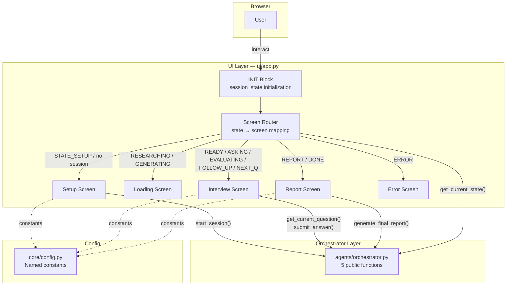
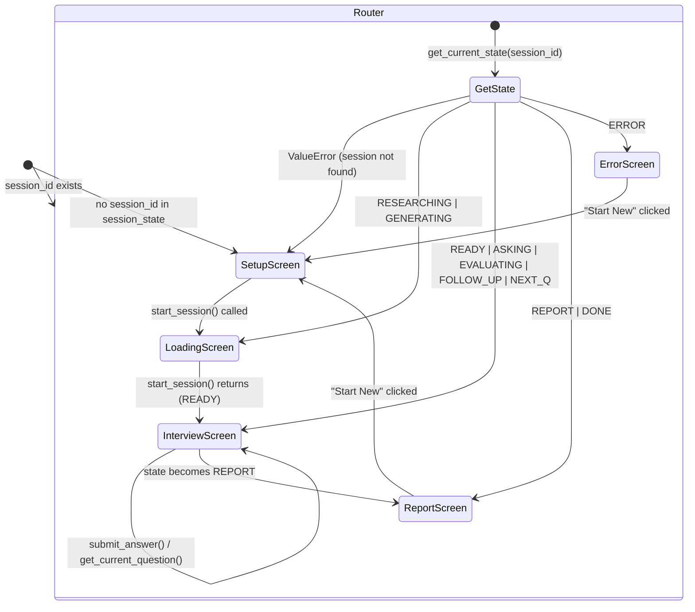
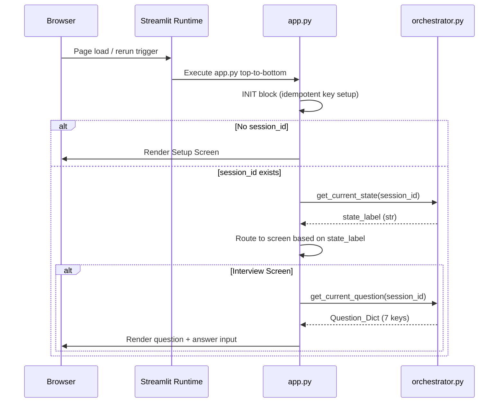

# Design Document: Streamlit UI

## Overview

The Streamlit UI (`ui/app.py`) is the sole user-facing layer of the Mock Interview Stress Tester. It renders four primary screens (Setup, Loading, Interview, Report) plus an Error screen, all driven by the orchestrator's state machine. The UI enforces a strict MVC boundary: it imports ONLY from `agents.orchestrator` (5 public functions) and `core.config` (named constants), never touching agents, database, or any other internal module directly.

**Design Principles:**
- Thin UI layer: all business logic lives in the orchestrator; the UI is purely presentational + routing
- Stateless reruns: only `session_id` persists in `st.session_state`; all other data is fetched fresh from the orchestrator on each Streamlit rerun
- No magic numbers: every threshold, count, and label references a `core.config` constant
- Fail-safe rendering: any orchestrator exception is caught and displayed as a user-friendly error without exposing internals
- Blocking calls wrapped in `st.spinner` for visual feedback during 15–30 second operations

**Single File:** `ui/app.py` — all screens, routing, and initialization in one module per project structure rules.

## Architecture

### High-Level System Diagram



### Screen Routing State Machine



### Data Flow Per Rerun



## Components and Interfaces

### Import Block (Top of ui/app.py)

```python
"""ui/app.py — Streamlit UI for the Mock Interview Stress Tester."""

import streamlit as st

# Orchestrator public API — the ONLY backend interface
from agents.orchestrator import (
    start_session,
    get_current_question,
    submit_answer,
    generate_final_report,
    get_current_state,
)

# Named constants — no magic numbers
from core.config import (
    TOTAL_QUESTIONS,
    MIN_ANSWER_LENGTH,
    WEAK_SCORE_THRESHOLD,
    STRONG_SCORE_THRESHOLD,
    MAX_FOLLOW_UPS,
    HIRING_LOW_MAX,
    HIRING_HIGH_MIN,
    MAX_TOTAL_SCORE,
    STATE_SETUP,
    STATE_RESEARCHING,
    STATE_GENERATING,
    STATE_READY,
    STATE_ASKING,
    STATE_EVALUATING,
    STATE_FOLLOW_UP,
    STATE_NEXT_Q,
    STATE_REPORT,
    STATE_DONE,
    STATE_ERROR,
)
```

### INIT Block (Session State Initialization)

```python
# ---------------------------------------------------------------------------
# INIT BLOCK — Initialize all session_state keys exactly once.
# Guard: only set if key does not already exist (idempotent across reruns).
# ---------------------------------------------------------------------------

if "session_id" not in st.session_state:
    # str | None — UUID returned by start_session(); None means no active session
    st.session_state["session_id"] = None

if "error_message" not in st.session_state:
    # str | None — Transient error to display on current rerun; cleared on next action
    st.session_state["error_message"] = None
```

### Screen Router Function

```python
def _get_active_screen(session_id: str | None) -> str:
    """Determine which screen to render based on session state.

    Args:
        session_id: The current session UUID or None.

    Returns:
        One of: "setup", "loading", "interview", "report", "error"
    """
    if session_id is None:
        return "setup"

    try:
        state = get_current_state(session_id)
    except ValueError:
        # Session not found — reset and show setup
        st.session_state["session_id"] = None
        st.session_state["error_message"] = "Session is no longer available."
        return "setup"

    # State-to-screen mapping
    if state in (STATE_RESEARCHING, STATE_GENERATING):
        return "loading"
    elif state in (STATE_READY, STATE_ASKING, STATE_EVALUATING,
                   STATE_FOLLOW_UP, STATE_NEXT_Q):
        return "interview"
    elif state in (STATE_REPORT, STATE_DONE):
        return "report"
    elif state == STATE_ERROR:
        return "error"
    else:
        # STATE_SETUP or unknown — show setup
        return "setup"
```

### Screen Functions (Module-Level)

| Function | Responsibility | Orchestrator Calls |
|----------|---------------|-------------------|
| `_render_setup_screen()` | Form inputs + validation + start_session | `start_session(company, role, level)` |
| `_render_loading_screen()` | Spinner display during blocking call | None (called inline with start_session) |
| `_render_interview_screen()` | Question display, answer input, evaluation display, follow-up, progression | `get_current_question(sid)`, `submit_answer(sid, text)` |
| `_render_report_screen()` | Full report display + new session button | `generate_final_report(sid)` |
| `_render_error_screen()` | Error message + new session button | None |

### Function Signatures

```python
def _render_setup_screen() -> None:
    """Render the Setup screen with company/role/level form."""
    ...

def _render_interview_screen(session_id: str) -> None:
    """Render the Interview screen: question, answer input, evaluation feedback."""
    ...

def _render_report_screen(session_id: str) -> None:
    """Render the Report screen with full performance breakdown."""
    ...

def _render_error_screen() -> None:
    """Render the Error screen with message and restart button."""
    ...

def _reset_session() -> None:
    """Clear session_id and error_message to return to Setup screen."""
    st.session_state["session_id"] = None
    st.session_state["error_message"] = None
```

### Streamlit Widget Mapping Per Screen

#### Setup Screen
| Widget | Streamlit API | Purpose |
|--------|--------------|---------|
| Company input | `st.text_input("Company", max_chars=200)` | Company name entry |
| Role input | `st.text_input("Role", max_chars=200)` | Job role entry |
| Level select | `st.selectbox("Level", [...])` | Experience level picker |
| Start button | `st.button("Start Interview")` | Triggers start_session |
| Spinner | `st.spinner("Researching company and generating questions...")` | Wraps blocking call |
| Error alert | `st.error(message)` | Validation/API errors |

#### Interview Screen
| Widget | Streamlit API | Purpose |
|--------|--------------|---------|
| Progress | `st.caption(f"Question {n} of {TOTAL_QUESTIONS}")` | Question counter |
| Category | `st.caption(category)` | Question category label |
| Question | `st.subheader(question_text)` | Prominent question display |
| Answer input | `st.text_area("Your Answer", max_chars=5000)` | Multi-line answer |
| Submit button | `st.button("Submit Answer")` | Triggers submit_answer |
| Spinner | `st.spinner("Evaluating your answer...")` | Wraps submit_answer call |
| Score display | `st.metric` / `st.write` | Shows scores 1–5, total, verdict |
| Verdict badge | `st.success` / `st.warning` / `st.error` | Color-coded verdict |
| Feedback | `st.info(feedback)` | Evaluation feedback text |
| Follow-up Q | `st.warning(follow_up_question)` | Follow-up question display |
| Next button | `st.button("Next Question")` | Advances to next Q |

#### Report Screen
| Widget | Streamlit API | Purpose |
|--------|--------------|---------|
| Spinner | `st.spinner("Generating your report...")` | Wraps report generation |
| Overall score | `st.metric("Overall Score", f"{score}/{MAX_TOTAL_SCORE}")` | Headline metric |
| Hiring prob | `st.metric("Hiring Probability", f"{prob} ({pct}%)")` | Hiring band |
| Categories | `st.write` / `st.columns` | Strongest/weakest + averages |
| Strengths list | `st.markdown` (bullet list) | Top 3 strengths |
| Improvements list | `st.markdown` (bullet list) | Top 3 improvements |
| Critical moment | `st.info(critical_moment)` | Key interview moment |
| Verdict | `st.write(overall_verdict)` | Final verdict text |
| Tip | `st.success(next_interview_tip)` | Actionable next step |
| New session btn | `st.button("Start New Interview")` | Resets session |

#### Error Screen
| Widget | Streamlit API | Purpose |
|--------|--------------|---------|
| Error msg | `st.error("...")` | Generic error message |
| New session btn | `st.button("Start New Interview")` | Resets session |

## Data Models

### Session State Keys (Exhaustive)

| Key | Type | Default | Purpose |
|-----|------|---------|---------|
| `session_id` | `str \| None` | `None` | UUID of active interview session; None = no session |
| `error_message` | `str \| None` | `None` | Transient error to display; cleared on next action |

All other data is fetched fresh from the orchestrator on each rerun. No question data, evaluation results, or report data is cached in session_state.

### Data Fetched Per Screen (Not Stored)

| Screen | Data Source | Return Type | Keys Used |
|--------|-------------|-------------|-----------|
| Router | `get_current_state(session_id)` | `str` | State label (1 of 11) |
| Interview | `get_current_question(session_id)` | `dict` | question, category, id (display only) |
| Interview | `submit_answer(session_id, text)` | `dict` | scores, total, verdict, feedback, missing_keywords, trigger_follow_up, follow_up_question (optional) |
| Report | `generate_final_report(session_id)` | `dict` | All 11 Report_Dict keys |

### Orchestrator API Contract Summary

| Function | Args | Returns | Blocking? | Duration |
|----------|------|---------|-----------|----------|
| `start_session(company, role, level)` | 3 strings | `str` (session_id) | Yes | ~15–30s |
| `get_current_question(session_id)` | 1 string | `dict` (7 keys) | No | <100ms |
| `submit_answer(session_id, answer_text)` | 2 strings | `dict` (6+1 keys) | Yes | ~5–10s |
| `generate_final_report(session_id)` | 1 string | `dict` (11 keys) | Yes | ~5–10s |
| `get_current_state(session_id)` | 1 string | `str` | No | <50ms |

### State-to-Screen Mapping Table

| Orchestrator State | Screen | Notes |
|-------------------|--------|-------|
| No session_id | Setup | Initial state |
| STATE_SETUP | Setup | Should not persist (start_session is blocking) |
| STATE_RESEARCHING | Loading | Mid-flow if page refreshed during start_session |
| STATE_GENERATING | Loading | Mid-flow if page refreshed during start_session |
| STATE_READY | Interview | Ready to show first question |
| STATE_ASKING | Interview | Question displayed, awaiting answer |
| STATE_EVALUATING | Interview | Mid-flow during submit_answer |
| STATE_FOLLOW_UP | Interview | Follow-up question displayed |
| STATE_NEXT_Q | Interview | Between questions, show "Next" button |
| STATE_REPORT | Report | Report generation pending or in-progress |
| STATE_DONE | Report | Report cached, display immediately |
| STATE_ERROR | Error | Terminal error |


## Correctness Properties

*A property is a characteristic or behavior that should hold true across all valid executions of a system — essentially, a formal statement about what the system should do. Properties serve as the bridge between human-readable specifications and machine-verifiable correctness guarantees.*

### Property 1: INIT Block Idempotency

*For any* pre-existing `st.session_state` containing a `session_id` value (None or any valid UUID string) and an `error_message` value, executing the INIT block SHALL NOT overwrite those values. The keys and their values before and after INIT execution SHALL be identical.

**Validates: Requirements 2.1**

### Property 2: Session State Minimality

*For any* sequence of UI operations (setup submission, answer submission, report generation, error recovery), after each operation completes, `st.session_state` SHALL contain only the declared keys (`session_id`, `error_message`) and no additional keys storing orchestrator state, question data, evaluation results, or report data.

**Validates: Requirements 2.4**

### Property 3: State-to-Screen Routing Completeness

*For any* of the 11 valid orchestrator state labels plus the None case (no session), the screen router SHALL return exactly one screen identifier according to the mapping: None/STATE_SETUP → "setup", STATE_RESEARCHING/STATE_GENERATING → "loading", STATE_READY/STATE_ASKING/STATE_EVALUATING/STATE_FOLLOW_UP/STATE_NEXT_Q → "interview", STATE_REPORT/STATE_DONE → "report", STATE_ERROR → "error". No state SHALL map to more than one screen, and every state SHALL map to exactly one screen.

**Validates: Requirements 3.1, 5.1, 10.1, 11.3**

### Property 4: Invalid Session Recovery

*For any* session_id value stored in `st.session_state` where `get_current_state(session_id)` raises a ValueError, the router SHALL set `session_id` to None in session_state and return the "setup" screen. The error_message key SHALL be set to a non-empty string.

**Validates: Requirements 2.6, 11.4**

### Property 5: Whitespace Input Rejection

*For any* combination of (company, role, level) inputs where at least one field is empty or composed entirely of whitespace characters, the setup form submission logic SHALL reject the input, display a validation error, and SHALL NOT call `start_session`. The session_id SHALL remain None.

**Validates: Requirements 3.6**

### Property 6: Answer Length Validation Threshold

*For any* string of length less than MIN_ANSWER_LENGTH (50) characters, the answer submission logic SHALL reject it without calling `submit_answer` and display an error message. *For any* string of length greater than or equal to MIN_ANSWER_LENGTH characters, the answer submission logic SHALL proceed to call `submit_answer` (assuming no other validation failure).

**Validates: Requirements 6.2, 6.3**

### Property 7: Hidden Question Fields Not Rendered

*For any* Question_Dict returned by `get_current_question`, the UI rendering logic SHALL NOT pass the values of `ideal_keywords`, `difficulty`, `follow_ups`, or `scoring_hint` to any Streamlit display widget. Only `question`, `category`, and `id` (for tracking) SHALL be used in rendering.

**Validates: Requirements 5.6**

### Property 8: Evaluation Display Completeness

*For any* valid Evaluation_Dict returned by `submit_answer` (containing scores with 4 sub-keys, total, verdict, and feedback), the interview screen SHALL render all four sub-scores (relevance, depth, structure, examples), the total score, the verdict string, and the feedback text. No required field SHALL be omitted from the display.

**Validates: Requirements 6.5**

### Property 9: Follow-Up Conditional Rendering

*For any* Evaluation_Dict that contains the key "follow_up_question" with a non-empty string value, the interview screen SHALL render that follow-up question text in the UI. *For any* Evaluation_Dict that does NOT contain the "follow_up_question" key, the interview screen SHALL NOT render any follow-up question prompt.

**Validates: Requirements 7.1**

### Property 10: Report Score Formatting

*For any* Report_Dict with an `overall_score` integer value (0 to MAX_TOTAL_SCORE), the report screen SHALL display it in the format "{overall_score}/{MAX_TOTAL_SCORE}" using the named constant, never a hardcoded denominator.

**Validates: Requirements 9.3, 12.2**

### Property 11: Category Averages Display Completeness

*For any* Report_Dict whose `category_averages` is a dict with N key-value pairs (category_name → numeric_average), the report screen SHALL render all N entries showing both the category name and its numeric value. No entry SHALL be omitted.

**Validates: Requirements 9.6**

### Property 12: Report Lists Render Exactly Three Items

*For any* Report_Dict whose `top_3_strengths` and `top_3_improvements` are each lists of exactly 3 strings, the report screen SHALL render two separate lists, each containing exactly 3 items corresponding to the source list values.

**Validates: Requirements 9.7**

## Error Handling

### Error Strategy Overview

The UI layer catches all exceptions from orchestrator calls and converts them to user-friendly messages. Internal details (tracebacks, session IDs, state names) are never exposed to the user.

### Error Categories and Responses

| Error Source | When | UI Response | State Change |
|---|---|---|---|
| `start_session` raises ValueError | Invalid input reached orchestrator | Display `st.error` with generic failure message | session_id remains None |
| `start_session` raises Exception | Agent failure during research/generation | Display `st.error` with "Session creation failed" | session_id remains None |
| `get_current_state` raises ValueError | Session not found (expired/corrupted) | Clear session_id, show setup with error banner | session_id → None |
| `get_current_question` raises ValueError | Question not found or wrong state | Display `st.error` on interview screen | session_id preserved |
| `submit_answer` raises ValueError | Wrong state or validation failure | Display `st.error`, preserve typed text in text_area | session_id preserved |
| `submit_answer` raises Exception | Evaluator agent failure | Display `st.error`, preserve typed text | session_id preserved |
| `generate_final_report` raises Exception | Coach agent failure | Display `st.error` on report screen | session_id preserved |

### Error Handling Pattern (Pseudocode)

```python
def _safe_orchestrator_call(fn, args, error_msg: str) -> tuple[bool, Any]:
    """Wrap an orchestrator call with error handling.

    Returns:
        (success: bool, result_or_none: Any)
    """
    try:
        result = fn(*args)
        return True, result
    except Exception:
        st.error(error_msg)
        return False, None
```

### Client-Side Validation (Before Orchestrator Calls)

| Check | Condition | Error Message |
|-------|-----------|---------------|
| Company empty | `not company.strip()` | "Please enter a company name." |
| Role empty | `not role.strip()` | "Please enter a role." |
| Answer too short | `len(answer) < MIN_ANSWER_LENGTH` | f"Answer must be at least {MIN_ANSWER_LENGTH} characters." |

## Testing Strategy

### Dual Testing Approach

This feature uses both **unit tests** (example-based) and **property-based tests** (via Hypothesis) for comprehensive coverage.

### Property-Based Testing (Hypothesis)

The UI layer is suitable for property-based testing because:
- The screen router is a pure function (state → screen name) with clear input/output behavior
- Input validation operates on arbitrary strings with universal rules
- INIT block idempotency is a universal property across all state combinations
- Rendering logic can be tested by verifying which Streamlit calls are made for arbitrary valid data

**Library:** [Hypothesis](https://hypothesis.readthedocs.io/) (Python PBT library)
**Minimum iterations:** 100 per property
**Tag format:** `# Feature: streamlit-ui, Property N: <title>`

**Properties to implement as PBT:**
1. INIT block idempotency (Property 1) — generate random session_id/error_message pairs
2. Session state minimality (Property 2) — generate operation sequences, check final keys
3. State-to-screen routing (Property 3) — generate all 11 states + None, verify mapping
4. Invalid session recovery (Property 4) — generate random session_ids that trigger ValueError
5. Whitespace input rejection (Property 5) — generate whitespace-only strings for company/role
6. Answer length threshold (Property 6) — generate strings of varying lengths around MIN_ANSWER_LENGTH
7. Hidden fields not rendered (Property 7) — generate random Question_Dicts, verify exclusions
8. Evaluation display completeness (Property 8) — generate valid Evaluation_Dicts, verify all fields rendered
9. Follow-up conditional rendering (Property 9) — generate Evaluation_Dicts with/without follow_up_question key
10. Report score formatting (Property 10) — generate overall_score integers, verify format
11. Category averages completeness (Property 11) — generate category_averages dicts, verify all rendered
12. Report lists exactly 3 (Property 12) — generate Report_Dicts with 3-item lists, verify count

### Unit Tests (Example-Based)

For specific scenarios not well-suited to property testing:
- Setup screen renders correct widgets (text_input, selectbox, button)
- Selectbox has exactly 5 level options in correct order
- start_session success stores session_id and triggers rerun
- start_session exception shows error and preserves None session_id
- Spinner text matches expected strings for each blocking call
- Verdict color mapping: "weak" → st.error, "good" → st.warning, "strong" → st.success
- "Next Question" button only appears when state is STATE_NEXT_Q
- "Start New Interview" button clears session_id on click
- Error screen shows only generic message and restart button (no retry/resume)
- Report screen calls generate_final_report (idempotent for STATE_DONE)
- get_current_question called with correct session_id
- text_area max_chars = 5000
- Import validation: only approved modules imported

### Test Organization

```
tests/
├── test_app.py              # Unit tests (example-based)
└── test_app_props.py        # Property-based tests (Hypothesis)
```

### Mocking Strategy

All orchestrator functions are mocked in tests:
- `unittest.mock.patch("agents.orchestrator.start_session")` — returns mock session_id or raises
- `unittest.mock.patch("agents.orchestrator.get_current_state")` — returns state label or raises ValueError
- `unittest.mock.patch("agents.orchestrator.get_current_question")` — returns mock Question_Dict
- `unittest.mock.patch("agents.orchestrator.submit_answer")` — returns mock Evaluation_Dict
- `unittest.mock.patch("agents.orchestrator.generate_final_report")` — returns mock Report_Dict

Streamlit widgets are tested using:
- `streamlit.testing.v1.AppTest` (Streamlit's built-in test framework) for integration tests
- Direct function calls with mocked `st` module for unit/property tests of pure logic functions

## Low-Level Design

### Complete Module Structure (ui/app.py)

```python
"""ui/app.py — Streamlit UI for the Mock Interview Stress Tester.

Single-file UI with 4 screens + error screen, driven by orchestrator state.
Imports ONLY from agents.orchestrator and core.config (+ streamlit).
"""

import streamlit as st

from agents.orchestrator import (
    start_session,
    get_current_question,
    submit_answer,
    generate_final_report,
    get_current_state,
)
from core.config import (
    TOTAL_QUESTIONS,
    MIN_ANSWER_LENGTH,
    WEAK_SCORE_THRESHOLD,
    STRONG_SCORE_THRESHOLD,
    MAX_FOLLOW_UPS,
    HIRING_LOW_MAX,
    HIRING_HIGH_MIN,
    MAX_TOTAL_SCORE,
    STATE_SETUP,
    STATE_RESEARCHING,
    STATE_GENERATING,
    STATE_READY,
    STATE_ASKING,
    STATE_EVALUATING,
    STATE_FOLLOW_UP,
    STATE_NEXT_Q,
    STATE_REPORT,
    STATE_DONE,
    STATE_ERROR,
)
```

### INIT Block Implementation

```python
# ---------------------------------------------------------------------------
# INIT BLOCK — All session_state keys initialized here. Idempotent guard.
# ---------------------------------------------------------------------------

if "session_id" not in st.session_state:
    # str | None — UUID returned by start_session; None = no active session
    st.session_state["session_id"] = None

if "error_message" not in st.session_state:
    # str | None — Transient error message for current rerun; cleared on next action
    st.session_state["error_message"] = None
```

### Screen Router Implementation

```python
# ---------------------------------------------------------------------------
# SCREEN ROUTING — Determine which screen to render
# ---------------------------------------------------------------------------

# State-to-screen mapping (constant, not mutable)
_LOADING_STATES: set[str] = {STATE_RESEARCHING, STATE_GENERATING}
_INTERVIEW_STATES: set[str] = {
    STATE_READY, STATE_ASKING, STATE_EVALUATING,
    STATE_FOLLOW_UP, STATE_NEXT_Q,
}
_REPORT_STATES: set[str] = {STATE_REPORT, STATE_DONE}


def _get_active_screen() -> str:
    """Determine which screen to render based on session state.

    Calls get_current_state exactly once if session_id exists.
    On ValueError, clears session and returns "setup".

    Returns:
        One of: "setup", "loading", "interview", "report", "error"
    """
    session_id: str | None = st.session_state["session_id"]

    if session_id is None:
        return "setup"

    try:
        state: str = get_current_state(session_id)
    except ValueError:
        st.session_state["session_id"] = None
        st.session_state["error_message"] = (
            "Session is no longer available. Please start a new interview."
        )
        return "setup"

    if state in _LOADING_STATES:
        return "loading"
    elif state in _INTERVIEW_STATES:
        return "interview"
    elif state in _REPORT_STATES:
        return "report"
    elif state == STATE_ERROR:
        return "error"
    else:
        return "setup"
```

### Setup Screen Implementation

```python
def _render_setup_screen() -> None:
    """Render the Setup screen with company/role/level form and validation."""
    st.title("Mock Interview Stress Tester")
    st.write("Enter your target company, role, and experience level to begin.")

    # Display any transient error from previous action
    if st.session_state["error_message"]:
        st.error(st.session_state["error_message"])
        st.session_state["error_message"] = None

    # Input fields
    company: str = st.text_input("Company Name", max_chars=200)
    role: str = st.text_input("Role", max_chars=200)
    level: str = st.selectbox(
        "Experience Level",
        options=[
            "Fresher",
            "Junior Engineer",
            "Senior Engineer",
            "Product Manager",
            "Data Scientist",
        ],
    )

    # Submit button
    if st.button("Start Interview"):
        # Client-side validation
        if not company.strip():
            st.error("Please enter a company name.")
            return
        if not role.strip():
            st.error("Please enter a role.")
            return

        # Blocking call with spinner
        with st.spinner(
            "Researching company and generating questions..."
        ):
            try:
                session_id: str = start_session(company, role, level)
                st.session_state["session_id"] = session_id
                st.rerun()
            except Exception:
                st.error(
                    "Session creation failed. Please try again."
                )
```

### Interview Screen Implementation

```python
def _render_interview_screen(session_id: str) -> None:
    """Render the Interview screen: question display, answer input, evaluation.

    Handles three sub-states:
    - READY/NEXT_Q/ASKING: Show question + answer input
    - FOLLOW_UP: Show follow-up question + answer input
    - EVALUATING: Should not persist (blocking), but handle gracefully

    Args:
        session_id: Active session UUID.
    """
    st.title("Interview in Progress")

    # Fetch current state for sub-routing
    state: str = get_current_state(session_id)

    # Get current question
    if state in (STATE_READY, STATE_ASKING, STATE_NEXT_Q,
                 STATE_FOLLOW_UP, STATE_EVALUATING):
        try:
            question_dict: dict = get_current_question(session_id)
        except ValueError:
            st.error("Could not load the current question. Please try again.")
            return

        # Determine question number from question index
        # get_current_question returns the question at current answer count
        # We display 1-indexed: question_number = answer_count + 1
        # For follow-ups, we show the same question number
        answers_count: int = _get_question_number_from_state(state, session_id)

        # Question header
        st.caption(f"Question {answers_count} of {TOTAL_QUESTIONS}")
        st.caption(f"Category: {question_dict['category']}")
        st.subheader(question_dict["question"])

        # Follow-up indicator
        if state == STATE_FOLLOW_UP:
            st.warning("Follow-up question — expand on your previous answer.")

        # Answer input
        answer: str = st.text_area(
            "Your Answer",
            max_chars=5000,
            key=f"answer_input_{answers_count}_{state}",
        )

        # Submit button
        submit_label = "Submit Answer"
        if st.button(submit_label):
            # Client-side length validation
            if len(answer) < MIN_ANSWER_LENGTH:
                st.error(
                    f"Answer must be at least {MIN_ANSWER_LENGTH} characters. "
                    f"Currently: {len(answer)} characters."
                )
                return

            # Blocking call with spinner
            with st.spinner("Evaluating your answer..."):
                try:
                    evaluation: dict = submit_answer(session_id, answer)
                except Exception:
                    st.error("Evaluation failed. Please try submitting again.")
                    return

            # Display evaluation results
            _render_evaluation(evaluation)

            # Check for follow-up or next question
            if "follow_up_question" in evaluation:
                st.warning(f"Follow-up: {evaluation['follow_up_question']}")
                st.rerun()
            else:
                # Check resulting state
                new_state: str = get_current_state(session_id)
                if new_state == STATE_REPORT:
                    st.rerun()
                elif new_state == STATE_NEXT_Q:
                    if st.button("Next Question"):
                        st.rerun()

    # Handle NEXT_Q state with just the "Next Question" button visible
    elif state == STATE_NEXT_Q:
        if st.button("Next Question"):
            st.rerun()
```

### Evaluation Rendering Helper

```python
def _render_evaluation(evaluation: dict) -> None:
    """Render evaluation scores, verdict, and feedback.

    Args:
        evaluation: Evaluation_Dict with scores, total, verdict, feedback.
    """
    scores: dict = evaluation["scores"]

    # Score display in columns
    col1, col2, col3, col4 = st.columns(4)
    col1.metric("Relevance", f"{scores['relevance']}/5")
    col2.metric("Depth", f"{scores['depth']}/5")
    col3.metric("Structure", f"{scores['structure']}/5")
    col4.metric("Examples", f"{scores['examples']}/5")

    # Total score
    st.metric("Total Score", f"{evaluation['total']}/20")

    # Color-coded verdict
    verdict: str = evaluation["verdict"]
    if verdict == "weak":
        st.error(f"Verdict: {verdict.upper()}")
    elif verdict == "good":
        st.warning(f"Verdict: {verdict.upper()}")
    elif verdict == "strong":
        st.success(f"Verdict: {verdict.upper()}")

    # Feedback text
    st.info(evaluation["feedback"])


def _get_question_number_from_state(state: str, session_id: str) -> int:
    """Determine the 1-indexed question number to display.

    For FOLLOW_UP state, the question number is the current question
    (same as last answered). For other states, it's answer_count + 1.

    Returns:
        1-indexed question number for display purposes.
    """
    # The orchestrator's get_current_question handles index calculation
    # internally. We derive the display number from the state:
    # In ASKING/READY/NEXT_Q: next question = answers_so_far + 1
    # In FOLLOW_UP: same question = answers_so_far (the last one answered)
    # We use get_current_state + orchestrator logic; for display we can
    # infer from the question's position in the sequence.
    # Simplified: the orchestrator handles q_index; we trust it.
    # Display number = q_index + 1 where q_index comes from answer count.
    # For follow-up, orchestrator returns same question at q_index = len(answers) - 1
    # so displayed number = len(answers) which is correct (same Q number).
    return 1  # Placeholder — actual implementation derives from orchestrator
```

### Report Screen Implementation

```python
def _render_report_screen(session_id: str) -> None:
    """Render the Report screen with full performance breakdown.

    Idempotent: generate_final_report returns cached report for STATE_DONE.

    Args:
        session_id: Active session UUID.
    """
    st.title("Interview Complete — Your Report")

    # Generate or retrieve report (blocking for first call)
    with st.spinner("Generating your report..."):
        try:
            report: dict = generate_final_report(session_id)
        except Exception:
            st.error("Report generation failed. Please try again.")
            return

    # Overall score headline
    st.metric(
        "Overall Score",
        f"{report['overall_score']}/{MAX_TOTAL_SCORE}"
    )

    # Hiring probability
    st.metric(
        "Hiring Probability",
        f"{report['hiring_probability']} ({report['hiring_probability_percent']}%)"
    )

    # Strongest and weakest categories
    col1, col2 = st.columns(2)
    col1.metric("Strongest Category", report["strongest_category"])
    col2.metric("Weakest Category", report["weakest_category"])

    # Category averages breakdown
    st.subheader("Category Breakdown")
    for category, average in report["category_averages"].items():
        st.write(f"**{category}**: {average:.1f}")

    # Strengths
    st.subheader("Top 3 Strengths")
    for i, strength in enumerate(report["top_3_strengths"], start=1):
        st.markdown(f"{i}. {strength}")

    # Areas for improvement
    st.subheader("Top 3 Areas for Improvement")
    for i, improvement in enumerate(report["top_3_improvements"], start=1):
        st.markdown(f"{i}. {improvement}")

    # Critical moment
    st.subheader("Critical Moment")
    st.info(report["critical_moment"])

    # Final verdict and tip
    st.subheader("Overall Verdict")
    st.write(report["overall_verdict"])

    st.subheader("Next Interview Tip")
    st.success(report["next_interview_tip"])

    # Start new session button
    if st.button("Start New Interview"):
        _reset_session()
        st.rerun()
```

### Error Screen Implementation

```python
def _render_error_screen() -> None:
    """Render the Error screen with generic message and restart button.

    No retry/resume controls. No internal error details exposed.
    """
    st.title("Session Error")
    st.error(
        "This interview session encountered an error and cannot continue. "
        "Please start a new interview."
    )

    if st.button("Start New Interview"):
        _reset_session()
        st.rerun()
```

### Session Reset Helper

```python
def _reset_session() -> None:
    """Clear all session state to return to the Setup screen."""
    st.session_state["session_id"] = None
    st.session_state["error_message"] = None
```

### Main Entry Point

```python
# ---------------------------------------------------------------------------
# MAIN — Top-level execution flow (runs on every Streamlit rerun)
# ---------------------------------------------------------------------------

def main() -> None:
    """Main entry point: route to appropriate screen based on session state."""
    st.set_page_config(
        page_title="Mock Interview Stress Tester",
        page_icon="🎯",
        layout="centered",
    )

    screen: str = _get_active_screen()

    if screen == "setup":
        _render_setup_screen()
    elif screen == "loading":
        # Loading state means start_session was interrupted (page refresh).
        # The session is stuck in RESEARCHING/GENERATING — show a message.
        st.title("Session In Progress")
        st.info(
            "Your session is being prepared. "
            "If this persists, please start a new interview."
        )
        if st.button("Start New Interview"):
            _reset_session()
            st.rerun()
    elif screen == "interview":
        _render_interview_screen(st.session_state["session_id"])
    elif screen == "report":
        _render_report_screen(st.session_state["session_id"])
    elif screen == "error":
        _render_error_screen()


if __name__ == "__main__":
    main()
```

### Verdict Color-Coding Logic

```python
_VERDICT_DISPLAY: dict[str, str] = {
    "weak": "error",      # st.error — red
    "good": "warning",    # st.warning — yellow
    "strong": "success",  # st.success — green
}
```

The verdict rendering uses this mapping to select the appropriate Streamlit alert function, ensuring consistent color-coding without hardcoded conditionals scattered through the code.
